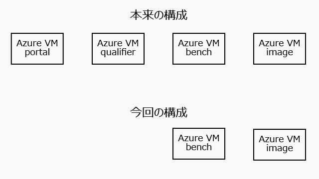
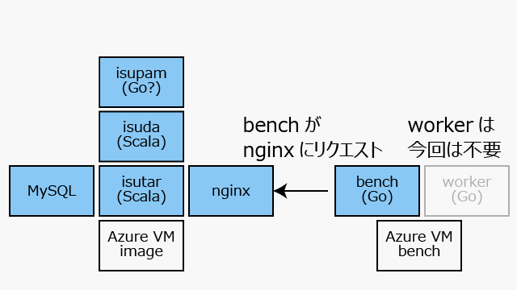
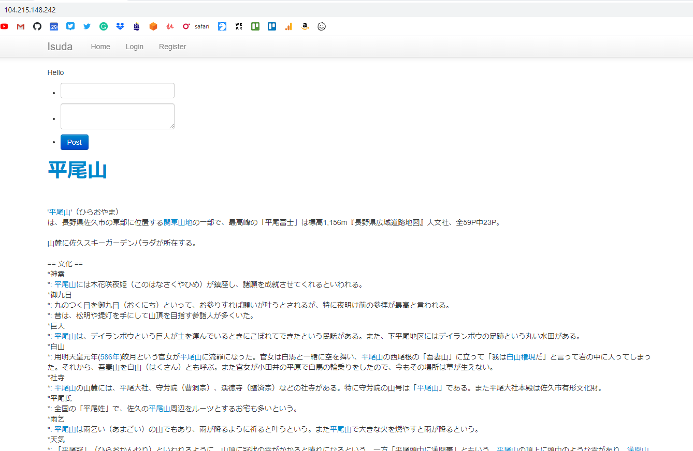

2020/08/30 日曜日 03:30 一人Isucon6開始

## 事前準備

[Isuconブログの記事](http://isucon.net/archives/48680557.html)[README.md](./README.md)と[provisiningディレクトリ](./provisioning/)の中身を参考にAzureのセットアップをしました。

> 今回は、予選環境にAzureを使いましたが、AzureではVMイメージの直接の提供が難しい代わりに、Deploy to Azure Buttonという便利な仕組みがあり、それを利用しました。

残念ながらDeploy to Azure Buttonでエラーが出てしまいました。 http://isucon6q.example.com/ などのリソースがシャットダウンされたことが原因と思われますが、エラーを解決するより手動でAzureをセットアップする方が早いと思ったので、手動セットアップをしています。



本来であればprovisiningディレクトリにあるように4台のAzure VMが使われたようですが:

- portalはwebサイトをホストし、ベンチマーカーのスケジューリングやスコア記録に使われた
- qualifierは用途不明、おそらくコンテストあとの追試用？

からimageとbenchという2つのVMだけ準備し、それぞれの上で走るプロセスは以下のようにしました。



benchとworkerはどちらもGoプロセスで、強調して動くのですが「workerがportalのwebサイトとやりとりし、workerを起動する」というしくのため、workerさえあれば手動で走らせてスコアを取得できます。

Azureの"deploy from template"でデプロイを試みたところprovisioningディレクトリ以下にあるAnsibleプレイブックが結構失敗している模様...(VMの/var/log/cloud-init-output.log)
各deploy.jsonのcustomdataをbase64でデコードして確認したところ、init.shを実行していただけなので、手動でinit.shと同様の作業をおこいました。

## 03:30 初回ベンチマーク実行 


```
bench -target "http://10.0.1.4"
2020/08/30 03:29:28 start pre-checking
2020/08/30 03:29:58 pre-check finished and start main benchmarking
2020/08/30 03:30:28 benchmarking finished
{"pass":true,"score":0,"success":269,"fail":26,"messages":["Response code should be 200, got 500, data:  (GET /)","Response code should be 302, got 500, data:  (POST /login)","Response code should be 302, got 500, data: アイドルメーカー・エッジ (POST /keyword)","Response code should be 302, got 500, data: 北消防 署 (POST /keyword)","Response code should be 400, got 500, data: 2001年宇宙の旅 (POST /keyword)","Response code should be 400, got 500, data: 岩原裕二 (POST /keyword)","Response code should be 400, got 500, data: 高橋留美子 (POST /keyword)","Response code should be 403, got 500, data:  (POST /login)","リクエスト がタイムアウトしました (GET /)"]}
```

pre-checkingは成功、successも269あるので、isuda、 isutar、 isupamは正しく動いているようですが、スコアはゼロ点スタートですね。作業時間は、初回のベンチマークがクラウド上で走ってから最大8時間とのことなので同日午前11:30までですね。ここまでの作業でGoのbenchを見てしまったり、provisioningディレクトリの中身からVMとプロセスの構成を知るなど、若干カンニング気味ではあります…。isuda/isutarに関してはほぼ中身はみてないですが。

## 03:50 初回ベンチマークの分析と分析ツールのセットアップ

このisuda/isutarアプリケーションは以下のようなページを返すようです。



初回は`Response code should be 200, got 500`のように500系エラーを返していたようですが、何度かベンチマーカーを走らせた結果がこちら、リクエストがタイム・アウトしました、という現象が頻発しているようです。

```
{"pass":true,"score":0,"success":210,"fail":39,"messages":["リクエストがタイムアウトしました (GET /)","リクエストがタイムアウトしました (GET /keyword/オートマチック限定免許)","リクエストがタイムアウトしました (GET /keyword/サミュエル・ゴーズミット)","リクエストがタイムアウトしました (GET /keyword/南蟹谷村)","リクエストがタイムアウトしました (GET /keyword/国道138号)","リクエストがタイムアウトしました (GET /keyword/菅山かおる)","リクエストがタイムアウトしま した (GET /keyword/輪状甲状筋)","リクエストがタイムアウトしました (GET /keyword/黒田倫弘)","リクエストがタイムアウトしました (POST /keyword)","リクエストが タイムアウトしました (POST /login)"]}
```

どうもタイム・アウトするほど遅いページがある？ブラウザからトップページにアクセスした動作も10秒以上かかってからようやくトップページが表示されるなど、だいぶ重たい印象です。

https://github.com/tkuchiki/alp/blob/69333d16570d17ef1b9c0820cf0ab7c786a616df/README.ja.md
ここでHTTPのエンドポイントごとの統計をとるためにalpをインストールします。上の方法を参考にnginx.confを書き換えて、/etc/nginx/nginx-isucon6.confに置きます。

うむ、おそいですね。10秒以上かかっているページがたくさんあります。

```
isucon@isucon6-webapp:~$ cat /var/log/nginx/access.log | alp ltsv

+-------+-----+-----+-----+-----+-----+--------+-------------------------------------+--------+--------+---------+--------+--------+--------+--------+--------+------------+------------+-------------+------------+
| COUNT | 1XX | 2XX | 3XX | 4XX | 5XX | METHOD |                 URI                 |  MIN   |  MAX   |   SUM   |  AVG   |   P1   |  P50   |  P99   | STDDEV | MIN(BODY)  | MAX(BODY)  |  SUM(BODY)  | AVG(BODY)  |
+-------+-----+-----+-----+-----+-----+--------+-------------------------------------+--------+--------+---------+--------+--------+--------+--------+--------+------------+------------+-------------+------------+
|     1 |   0 |   1 |   0 |   0 |   0 | GET    | /keyword/宮津天橋立インターチェンジ |  2.705 |  2.705 |   2.705 |  2.705 |  2.705 |  2.705 |  2.705 |  0.000 |   5738.000 |   5738.000 |    5738.000 |   5738.000 |
|     1 |   0 |   0 |   0 |   1 |   0 | GET    | /keyword/国道138号                  | 15.005 | 15.005 |  15.005 | 15.005 | 15.005 | 15.005 | 15.005 |  0.000 |      0.000 |      0.000 |       0.000 |      0.000 |
|     1 |   0 |   0 |   0 |   0 |   1 | GET    | /keyword/鳥取中央農業協同組合       |  0.204 |  0.204 |   0.204 |  0.204 |  0.204 |  0.204 |  0.204 |  0.000 |  37062.000 |  37062.000 |   37062.000 |  37062.000 |
|     1 |   0 |   0 |   0 |   1 |   0 | GET    | /keyword/オートマチック限定免許     | 15.001 | 15.001 |  15.001 | 15.001 | 15.001 | 15.001 | 15.001 |  0.000 |      0.000 |      0.000 |       0.000 |      0.000 |
|     1 |   0 |   0 |   0 |   1 |   0 | GET    | /keyword/黒田倫弘                   | 14.997 | 14.997 |  14.997 | 14.997 | 14.997 | 14.997 | 14.997 |  0.000 |      0.000 |      0.000 |       0.000 |      0.000 |
|     1 |   0 |   0 |   0 |   1 |   0 | GET    | /keyword/サミュエル・ゴーズミット   | 14.997 | 14.997 |  14.997 | 14.997 | 14.997 | 14.997 | 14.997 |  0.000 |      0.000 |      0.000 |       0.000 |      0.000 |
|     1 |   0 |   1 |   0 |   0 |   0 | GET    | /keyword/605年                      |  4.644 |  4.644 |   4.644 |  4.644 |  4.644 |  4.644 |  4.644 |  0.000 |   2236.000 |   2236.000 |    2236.000 |   2236.000 |
|     1 |   0 |   1 |   0 |   0 |   0 | GET    | /keyword/692年                      |  4.956 |  4.956 |   4.956 |  4.956 |  4.956 |  4.956 |  4.956 |  0.000 |   3816.000 |   3816.000 |    3816.000 |   3816.000 |
|     1 |   0 |   1 |   0 |   0 |   0 | GET    | /keyword/宇都宮信房                 |  4.224 |  4.224 |   4.224 |  4.224 |  4.224 |  4.224 |  4.224 |  0.000 |   3407.000 |   3407.000 |    3407.000 |   3407.000 |
|     1 |   0 |   1 |   0 |   0 |   0 | GET    | /keyword/伊藤里奈                   |  5.624 |  5.624 |   5.624 |  5.624 |  5.624 |  5.624 |  5.624 |  0.000 |   6090.000 |   6090.000 |    6090.000 |   6090.000 |
|     1 |   0 |   0 |   1 |   0 |   0 | GET    | /css/main.css                       |  0.428 |  0.428 |   0.428 |  0.428 |  0.428 |  0.428 |  0.428 |  0.000 |      0.000 |      0.000 |       0.000 |      0.000 |
|     1 |   0 |   1 |   0 |   0 |   0 | GET    | /keyword/東洋英和女学院大学         |  5.624 |  5.624 |   5.624 |  5.624 |  5.624 |  5.624 |  5.624 |  0.000 |   8685.000 |   8685.000 |    8685.000 |   8685.000 |
|     1 |   0 |   0 |   1 |   0 |   0 | GET    | /js/star.js                         |  0.212 |  0.212 |   0.212 |  0.212 |  0.212 |  0.212 |  0.212 |  0.000 |      0.000 |      0.000 |       0.000 |      0.000 |
|     1 |   0 |   1 |   0 |   0 |   0 | GET    | /keyword/浅間山                     |  1.505 |  1.505 |   1.505 |  1.505 |  1.505 |  1.505 |  1.505 |  0.000 |  44562.000 |  44562.000 |   44562.000 |  44562.000 |
|     1 |   0 |   0 |   0 |   1 |   0 | GET    | /keyword/源仲綱                     | 13.692 | 13.692 |  13.692 | 13.692 | 13.692 | 13.692 | 13.692 |  0.000 |      0.000 |      0.000 |       0.000 |      0.000 |
|     2 |   0 |   2 |   0 |   0 |   0 | GET    | /keyword/平尾山                     |  1.740 |  2.261 |   4.001 |  2.001 |  2.261 |  2.261 |  2.261 |  0.261 |   6365.000 |   6365.000 |   12730.000 |   6365.000 |
|     2 |   0 |   2 |   0 |   0 |   0 | GET    | /keyword/日本列島ほっと通信         |  2.896 |  3.213 |   6.109 |  3.054 |  3.213 |  3.213 |  3.213 |  0.159 |  23315.000 |  23315.000 |   46630.000 |  23315.000 |
|     2 |   0 |   0 |   0 |   2 |   0 | GET    | /keyword/南蟹谷村                   |  1.292 | 15.000 |  16.292 |  8.146 | 15.000 | 15.000 | 15.000 |  6.854 |      0.000 |      0.000 |       0.000 |      0.000 |
|     2 |   0 |   0 |   0 |   2 |   0 | GET    | /keyword/菅山かおる                 |  4.284 | 15.001 |  19.285 |  9.643 | 15.001 | 15.001 | 15.001 |  5.358 |      0.000 |      0.000 |       0.000 |      0.000 |
|     2 |   0 |   0 |   0 |   2 |   0 | GET    | /keyword/輪状甲状筋                 | 11.752 | 15.001 |  26.753 | 13.377 | 15.001 | 15.001 | 15.001 |  1.624 |      0.000 |      0.000 |       0.000 |      0.000 |
|     2 |   0 |   2 |   0 |   0 |   0 | GET    | /keyword/ウーズ                     |  4.476 |  4.644 |   9.120 |  4.560 |  4.476 |  4.476 |  4.476 |  0.084 |   2273.000 |   2273.000 |    4546.000 |   2273.000 |
|     2 |   0 |   2 |   0 |   0 |   0 | GET    | /keyword/毛細管現象                 |  4.072 |  5.496 |   9.568 |  4.784 |  5.496 |  5.496 |  5.496 |  0.712 |   5002.000 |   5002.000 |   10004.000 |   5002.000 |
|     2 |   0 |   2 |   0 |   0 |   0 | GET    | /keyword/内田修平                   |  5.408 |  5.908 |  11.316 |  5.658 |  5.908 |  5.908 |  5.908 |  0.250 |   6528.000 |   6528.000 |   13056.000 |   6528.000 |
|     2 |   0 |   2 |   0 |   0 |   0 | GET    | /keyword/イギリス政府               |  6.264 |  6.628 |  12.892 |  6.446 |  6.628 |  6.628 |  6.628 |  0.182 |   7554.000 |   7554.000 |   15108.000 |   7554.000 |
|     2 |   0 |   1 |   0 |   0 |   1 | GET    | /initialize                         |  0.088 |  0.352 |   0.440 |  0.220 |  0.088 |  0.088 |  0.088 |  0.132 |     15.000 |  33562.000 |   33577.000 |  16788.500 |
|     3 |   0 |   0 |   0 |   3 |   0 | GET    | /css/scalate/errors.css             |  0.064 |  0.072 |   0.204 |  0.068 |  0.068 |  0.068 |  0.064 |  0.003 |    306.000 |    306.000 |     918.000 |    306.000 |
|    15 |   0 |  14 |   1 |   0 |   0 | GET    | /js/jquery.min.js                   |  0.212 |  1.180 |   7.580 |  0.505 |  0.344 |  0.964 |  0.752 |  0.275 |  86351.000 |  86351.000 | 1208914.000 |  80594.267 |
|    15 |   0 |  14 |   1 |   0 |   0 | GET    | /js/bootstrap.min.js                |  0.228 |  1.264 |   8.104 |  0.540 |  0.336 |  0.872 |  0.616 |  0.261 |  28631.000 |  28631.000 |  400834.000 |  26722.267 |
|    15 |   0 |  14 |   1 |   0 |   0 | GET    | /img/star.gif                       |  0.224 |  0.708 |   7.236 |  0.482 |  0.356 |  0.656 |  0.592 |  0.168 |     93.000 |     93.000 |    1302.000 |     86.800 |
|    15 |   0 |  14 |   1 |   0 |   0 | GET    | /css/bootstrap-responsive.min.css   |  0.208 |  1.064 |   7.324 |  0.488 |  0.304 |  0.520 |  0.632 |  0.211 |  16849.000 |  16849.000 |  235886.000 |  15725.733 |
|    18 |   0 |  18 |   0 |   0 |   0 | GET    | /favicon.ico                        |  0.068 |  1.056 |   7.608 |  0.423 |  0.088 |  0.248 |  0.620 |  0.263 |   1092.000 |   1092.000 |   19656.000 |   1092.000 |
|    29 |   0 |  28 |   1 |   0 |   0 | GET    | /css/bootstrap.min.css              |  0.220 |  1.132 |  15.192 |  0.524 |  0.300 |  1.076 |  0.548 |  0.240 | 106015.000 | 106015.000 | 2968420.000 | 102359.310 |
|    30 |   0 |   3 |   0 |  24 |   3 | GET    | /                                   |  0.068 | 15.001 | 395.717 | 13.191 |  0.068 | 15.001 | 15.001 |  4.501 |      0.000 |  83571.000 |  349885.000 |  11662.833 |
|    38 |   0 |   0 |  10 |  28 |   0 | POST   | /keyword                            |  0.360 |  3.001 |  40.874 |  1.076 |  0.616 |  0.664 |  0.716 |  0.720 |      0.000 |      5.000 |     125.000 |      3.289 |
|    69 |   0 |   0 |  49 |  13 |   7 | POST   | /login                              |  0.132 |  3.000 |  56.851 |  0.824 |  0.164 |  0.624 |  0.828 |  0.723 |      0.000 |  35641.000 |  230371.000 |   3338.710 |
+-------+-----+-----+-----+-----+-----+--------+-------------------------------------+--------+--------+---------+--------+--------+--------+--------+--------+------------+------------+-------------+------------+
```

それから、これを参考にMySQLのslow-query-logを設定し...

https://www.youtube.com/watch?v=noFn2sgQiNw

```
mysql> SET GLOBAL slow_query_log='ON';
mysql> SHOW GLOBAL VARIABLES LIKE '%slow_query%';
+---------------------+----------------------------------------+
| Variable_name       | Value                                  |
+---------------------+----------------------------------------+
| slow_query_log      | ON                                     |
| slow_query_log_file | /var/lib/mysql/isucon6-webapp-slow.log |
+---------------------+----------------------------------------+

mysql> SET GLOBAL long_query_time=0;
mysql> select @@global.long_query_time;
+--------------------------+
| @@global.long_query_time |
+--------------------------+
|                 0.000000 |
+--------------------------+
1 row in set (0.00 sec)
```

...pt-query-digestも入れておきます。

https://gist.github.com/yuuki/aef3b7c91f23d1f02aaa266ebe858383


```
sudo cat less /var/lib/mysql/isucon6-webapp-slow.log | pt-query-digest
cat: less: No such file or directory
Reading from STDIN ...

# 510ms user time, 0 system time, 35.21M rss, 102.94M vsz
# Current date: Sat Aug 29 19:33:37 2020
# Hostname: isucon6-webapp
# Files: STDIN
# Overall: 1.95k total, 21 unique, 19.45 QPS, 2.89x concurrency __________
# Time range: 2020-08-29T19:14:19 to 2020-08-29T19:15:59
# Attribute          total     min     max     avg     95%  stddev  median
# ============     ======= ======= ======= ======= ======= ======= =======
# Exec time           289s    39us      3s   149ms      2s   490ms    89us
# Lock time          153ms       0    95ms    78us    93us     2ms       0
# Rows sent          1.34M       0   6.94k  723.52   6.63k   2.00k       0
# Rows examine       2.85M       0  13.88k   1.50k  13.78k   4.20k       0
# Query size       130.25k      13  16.41k   68.57   65.89  454.82   31.70

# Profile
# Rank Query ID                       Response time  Calls R/Call V/M   It
# ==== ============================== ============== ===== ====== ===== ==
#    1 0x28BC6892F47C29FC6C987DBB9... 287.5218 99.3%   198 1.4521  0.38 SELECT entry
# MISC 0xMISC                           1.9607  0.7%  1747 0.0011   0.0 <20 ITEMS>

# Query 1: 2 QPS, 2.90x concurrency, ID 0x28BC6892F47C29FC6C987DBB94BEC091 at byte 357136
# This item is included in the report because it matches --limit.
# Scores: V/M = 0.38
# Time range: 2020-08-29T19:14:20 to 2020-08-29T19:15:59
# Attribute    pct   total     min     max     avg     95%  stddev  median
# ============ === ======= ======= ======= ======= ======= ======= =======
# Count         10     198
# Exec time     99    288s   214ms      3s      1s      3s   746ms      2s
# Lock time     11    17ms    48us   545us    85us   108us    46us    76us
# Rows sent     99   1.34M   6.93k   6.94k   6.94k   6.63k       0   6.63k
# Rows examine  94   2.68M  13.87k  13.88k  13.88k  13.78k       0  13.78k
# Query size     9  12.96k      67      67      67      67       0      67
# String:
# Databases    isuda
# Hosts        localhost
# Users        root
# Query_time distribution
#   1us
#  10us
# 100us
#   1ms
#  10ms
# 100ms  ##################################
#    1s  ################################################################
#  10s+
# Tables
#    SHOW TABLE STATUS FROM `isuda` LIKE 'entry'\G
#    SHOW CREATE TABLE `isuda`.`entry`\G
# EXPLAIN /*!50100 PARTITIONS*/
SELECT * FROM entry
        ORDER BY CHARACTER_LENGTH(keyword) DESC\G
```        


ツールのインストールにだいぶ手間取ってしまいました。まだベンチマークの分析は続きますが、いったんここでgit commit